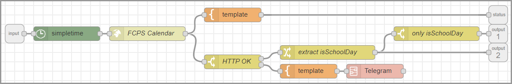

# Fairfax County Public Schools  - Standard School Calendar

This is my attempt to setup automation logic based on when my local school system has student days or not. As anyone with kids is aware, the days that kids have off is quite random and one jurisdiction does not have the same school days as another.

So, I put a calendar templating system together where I could build a calendar template and then another script to generate 365 JSON files from that template to use in my automation.

The concept is that each different school system should fork this project, edit the calendar template, and then generate the JSON files for everyone to use in that district.

My hope is that others need something like this and are interested in refining the process.

## Fork for your school dstrict

- Fork project
- Run ```perl generator-calendar-template.pl 2022 > my-school-calendar-2022.txt```
- Edit template ```vi my-school-calendar-2022.txt```
- Generate 365 JSON files ```processor-calendar-to-json-files.pl < my-school-calendar-2022.txt```
- Update documentation for your school.
- Commit and push your implementation back to GitHub for others to share.

## Data Source

- [2021-2022](https://www.fcps.edu/sites/default/files/media/forms/2021-2022-standard-school-calendar.pdf)
- [2022-2023](https://www.fcps.edu/sites/default/files/2022-2023-standard-school-year-calendar.pdf)
- [2023-2024](https://go.boarddocs.com/vsba/fairfax/Board.nsf/files/CNW29Q012041/$file/2023-2024-standard-school-year-calendar-option-BLUE-DRAFT-VERSION-2-AMENDED.pdf)
- [2024-2025](https://go.boarddocs.com/vsba/fairfax/Board.nsf/files/CNW29S01214F/$file/2024-2025-standard-school-year-calendar-BLUE-DRAFT-AMENDED.pdf)
- [2025-2026](https://go.boarddocs.com/vsba/fairfax/Board.nsf/files/CNW29V0122C1/$file/2025-2026-standard-school-year-calendar-BLUE-DRAFT-AMENDED.pdf)

## Calendar Template Format

You can generate a blank calendar template file with the script ```generator-calendar-template.pl```

The Calendar Template Format is a text file with new lines terminators:

```
[Header]
[Empty line]
[Body]
```

### Header

The __Header__ is a key value pair that is added to every JSON daily file.

__Header__ rows are formatted as:

```
[Key: Value]\n
[Key: Value]\n
...
[Key: Value]\n
```

Note: Key cannot contain the colon character ```:```.

### Empty Line

The __Empty Line__ is a single empty line terminated with a single newline character ```\n```

### Body

The __Body__ is a comma separated row of data terminated with a new line ```\n```.

Example: ```2022-01-17,0,0,H,Holiday (Martin Luther King Jr.'s Birthday)```

```[Date],[Student School Day],[Staff Work Day],[Option Codes],[Notes]```

__Date__ is YYYY-MM-DD formatted date.  This maps to ```json.dt``` data element.

__Student School Day__ is either a 1 or 0 based on weather students should report to school on that day. This maps to the ```json.student``` boolean data element.

__Staff Work Day__ is either a 1 or 0 based on weather staff should report to school on that day. This maps to the ```json.staff``` boolean data element.

__Option Codes__ is a list of foward slash separated codes that appears as keys in the ```json.options``` object with true values.

__Notes__ a text string that can be use for display.  This maps to the ```json.notes``` string data element.

## Generated JSON Files

The script ```processor-calendar-to-json-files.pl``` processes the Calendar Template File and generates individual daily JSON files.

The following is a generated JSON file for January 17, 2022 which is a student holiday, a staff holiday, has an option code of H, and a display note. 

```
{
   "authority" : "Farifax County Public Schools",
   "calendar" : "2021-2022 Standard School Year",
   "dt" : "2022-01-17",
   "students" : false,
   "staff" : false,
   "notes" : "Holiday (Martin Luther King Jr.'s Birthday)",
   "options" : {
      "H" : true
   }
}
```

## Node-Red Integration

I use the simpletime node to get the current day in the correct time zone then pass that to an http request node to access a particular JSON file on this GitHub repository.

  - simpletime node - sets msg.myymd
  - http request node - calls url and returns a parsed JSON object
    - Mustache URL: https://raw.githubusercontent.com/mrdvt92/fcps-calendar-school-standard/main/files/{{myymd}}.json
  - switch node - extracts the mgs.payload.students boolean value and routes if true



```json
[{"id":"6484cc41.ffd464","type":"simpletime","z":"38f7e094.e9845","name":"","mydate":true,"myymd":true,"myyear":true,"mymonth":true,"mymonthn":true,"mydom":true,"mydoy":true,"myday":true,"myhourpm":true,"myhour":true,"mytime":true,"mytimes":true,"myminute":true,"myminutes":true,"mysecond":true,"mymillis":true,"myepoch":true,"myrawdate":true,"mypm":true,"x":150,"y":80,"wires":[["67a48a16.2aece4"]]},{"id":"67a48a16.2aece4","type":"http request","z":"38f7e094.e9845","name":"FCPS Calendar","method":"GET","ret":"obj","paytoqs":false,"url":"https://raw.githubusercontent.com/mrdvt92/fcps-calendar-school-standard/main/files/{{myymd}}.json","tls":"","persist":false,"proxy":"","authType":"","x":320,"y":80,"wires":[["982e686b.9c5998","b1e05407.50f5d8"]]},{"id":"982e686b.9c5998","type":"switch","z":"38f7e094.e9845","name":"HTTP OK","property":"statusCode","propertyType":"msg","rules":[{"t":"eq","v":"200","vt":"str"},{"t":"else"}],"checkall":"true","repair":false,"outputs":2,"x":500,"y":140,"wires":[["b33d7fa9.0487a"],["a7df2028.403f4"]]},{"id":"b33d7fa9.0487a","type":"change","z":"38f7e094.e9845","name":"extract isSchoolDay","rules":[{"t":"set","p":"response","pt":"msg","to":"payload","tot":"msg"},{"t":"set","p":"payload","pt":"msg","to":"payload.students","tot":"msg"},{"t":"set","p":"isSchoolDay","pt":"global","to":"payload","tot":"msg"}],"action":"","property":"","from":"","to":"","reg":false,"x":700,"y":120,"wires":[["a06af716.382b88"]]},{"id":"a06af716.382b88","type":"switch","z":"38f7e094.e9845","name":"only isSchoolDay","property":"payload","propertyType":"msg","rules":[{"t":"true"}],"checkall":"true","repair":false,"outputs":1,"x":930,"y":80,"wires":[[]]},{"id":"b1e05407.50f5d8","type":"template","z":"38f7e094.e9845","name":"","field":"payload","fieldType":"msg","format":"handlebars","syntax":"mustache","template":"{{statusCode}}:{{payload.students}} - ({{myday}} {{myhourpm}}:{{myminute}} {{mypm}})","output":"str","x":500,"y":40,"wires":[[]]}]
```
